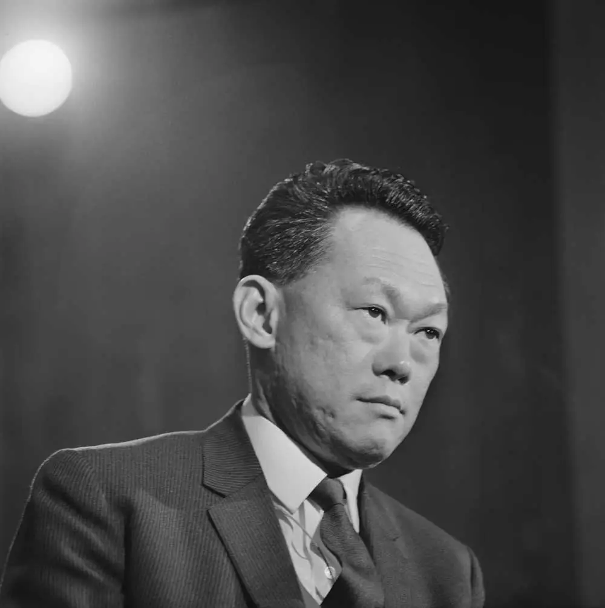
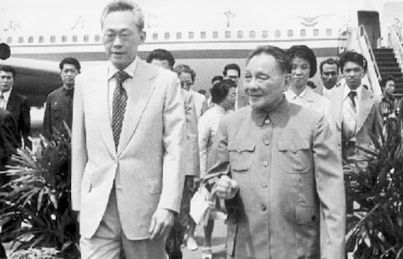
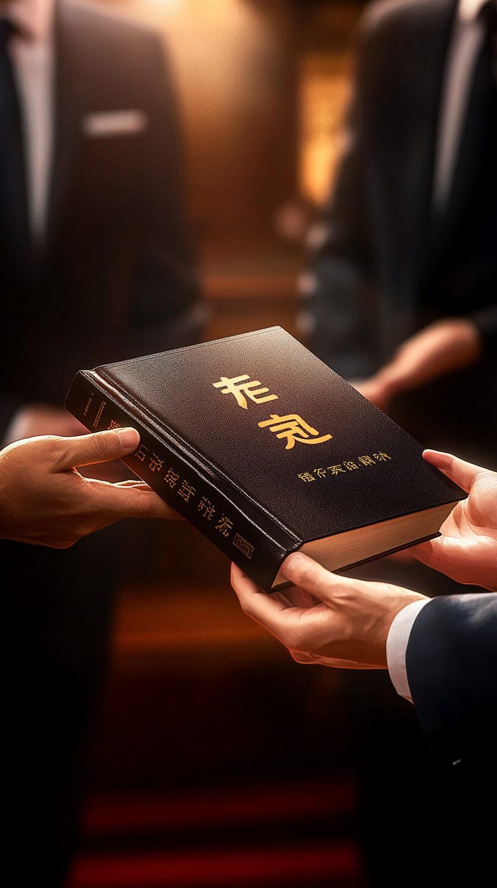
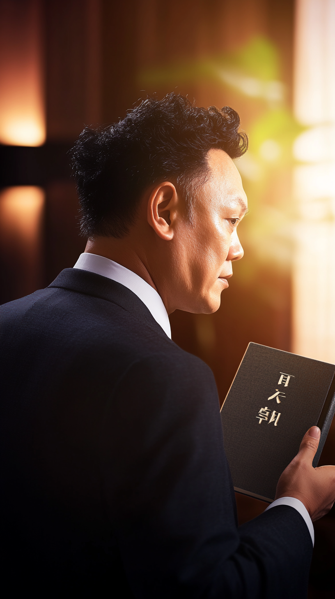
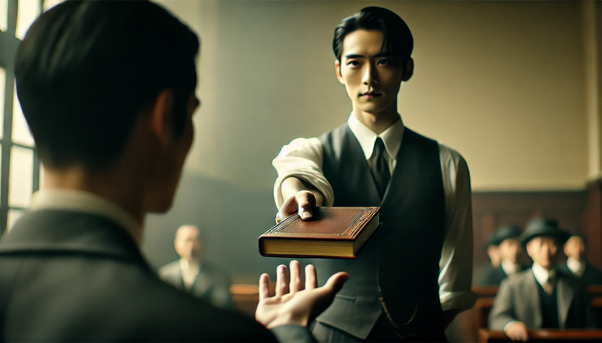
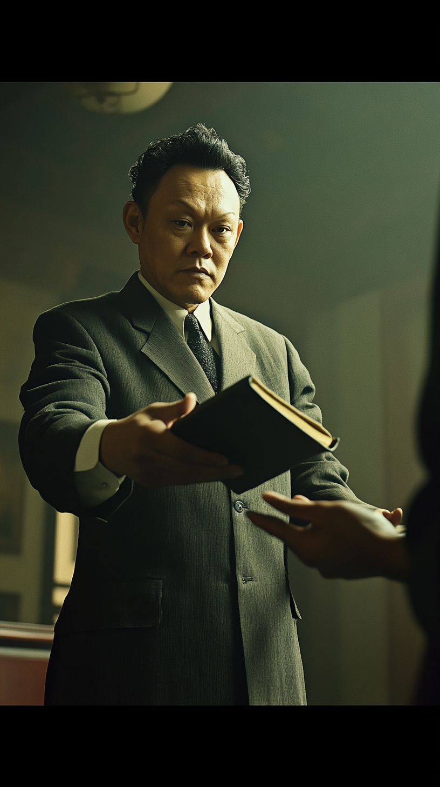
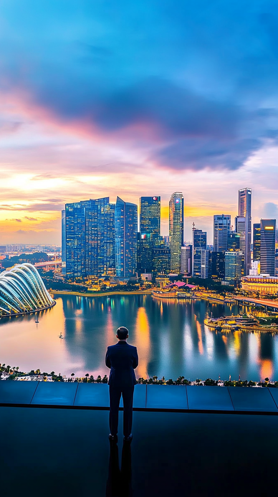
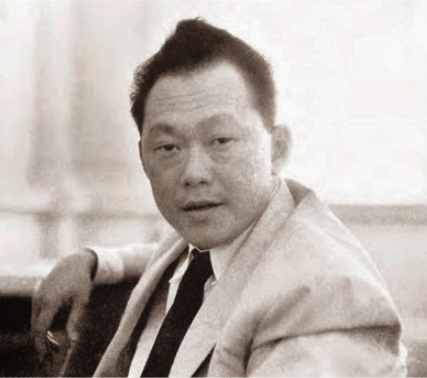
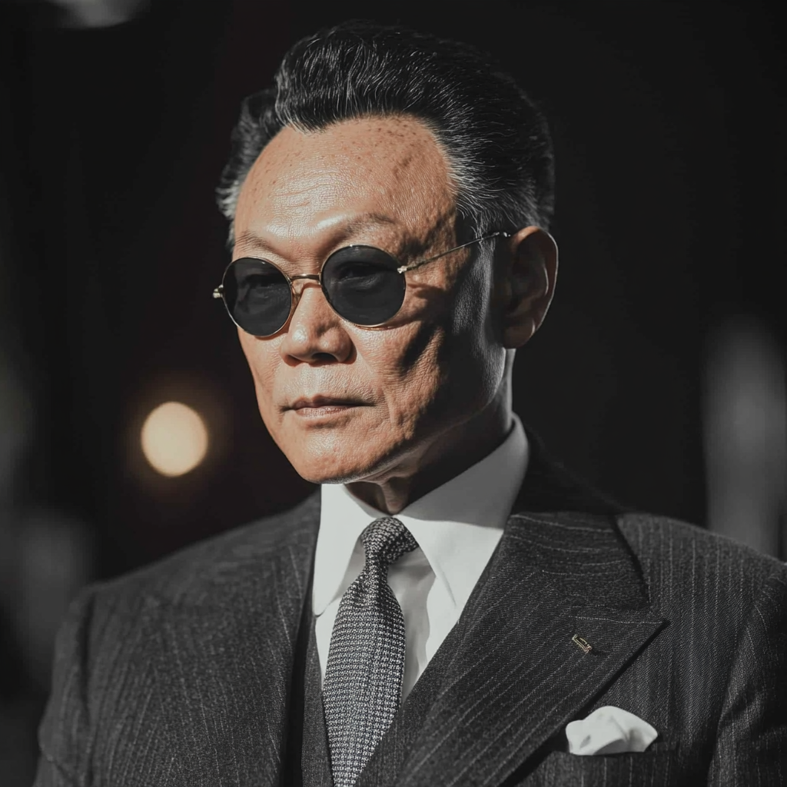

---
---

## Scene 1:

### Midjourney Prompt:

A stylized map showing the tense political atmosphere of Southeast Asia in the 1960s, with dramatic music building in the background. --v 6.1

### Generated Image:

### Runway Prompt:

The camera starts with a wide, vintage-style map of Southeast Asia, its muted greens and browns evoking an era of unrest. Slowly, it zooms in on Vietnam, Laos, and Cambodia, where borders subtly pulse with an ominous red glow. As the camera focuses in, bold arrows—one red, one blue—move across the terrain, clashing at key points, representing the Cold War forces of communism and anti-communism. Text labels like "Domino Theory" and "Tet Offensive" fade in and out as political symbols of the USSR, USA, and China hover over their spheres of influence. Dramatic music swells, punctuated by subtle sound effects of marching and distant explosions, intensifying as small flashes mark key battles, capturing the region’s tense political atmosphere of the 1960s.

---

## Scene 2:

### Midjourney Prompt:

create an over shoulder view photo at size 780 x 1280, subject is the back side of a standing man in suit, background is an aggressive conference --v 6.1

### Generated Image:

### Runway Prompt:

create a 360 degree spinning camera start from his back and end in his face portrait. (10sec)
inserted generated image for start and lky img for end.

### End Image:

---

## Scene 3:

### RUNWAY Prompt:

zoom out camera from the 2 guys shaking hands then walk together

### Seed Image:

---

## Scene 4:

### Midjourney Prompt:

cinematic shot of Close-up of hands Description: A hand offers a book to another hand, titled Sino-India War with Chinese Characters. other hand receives it. The camera follows the book as it changes hands. --ar 9:16 --v 6.1

### Generated Image:

### Runway Prompt:

zoom out camera, the guy pick up the book and read doubtfully , remove the book's text during transition

### End Image:

### Midjourney Prompt:

Cinematic frontal shot focusing on Lee's face examines the book's back cover. Closed book. examining the back cover doubtfully with a calm demeanour contrasts with tension in the room. Capturing his control and unflinching composure. --v 6.1 --no open-book --ar 9:16 --cw 100

### Generated Image:

## 

## Scene 5:

### Midjourney Prompt:

Cinematic over the shoulder shot as Lee examines the book's back cover. Closed book. examining the back cover doubtfully with a calm demeanour contrasts with tension in the room. Capturing his control and unflinching composure. --v 6.1 --no open-book --ar 9:16 --cw 100

### Generated Image:

### Midjourney Prompt:

A cinematic wide shot captures Lee standing tall in a dimly lit room, both hands firmly grasping a closed book as he extends it back towards Hua Guofeng. His arms are not fully outstretched, but rather positioned in a deliberate gesture of returning the item. Lee's movement appears slow and purposeful, the action unmistakably a rejection. His eyes are locked on Hua, his expression calm but resolute, conveying unwavering certainty in his decision. The atmosphere is tense yet controlled, with Lee's quiet confidence and diplomatic poise taking center stage, emphasizing the significance of this refusal. The composition highlights the book as the focal point between the two figures, symbolizing the weight of Lee's rejection. --v 6.1 --no open book --ar 9:16 --cw 50 --iw 0.5

#### Seed Images:

1. 
2. 

### Generated Image:

### Runway Prompt:

Spinning camera from back to front, the guy is returning the book

---

## Scene 6:

### Runway Prompt:

Lip Sync Text Input:
And in any case...I am from Southeast Asia. It is nothing to do with us.

---

## Scene 7:

### Midjourney Prompt:

cinematic drone view of modern day singapore. zoomed out with one man's sillouhette Lee Kuan Yew watching over the entire booming economy of singapore. --v 6.1 --no open book --ar 9:16 --cw 50 --iw 0.5

### Generated Image:

### Runway Prompt:

Wide angle zoom out on the success of modern day Singapore.

---

## Scene 8:

### Runway Prompt:

close up zoom in determination of the eye. cinematic, slow motion Ultra Realistic 4k

### Seed Image:

## 

---

## Scene 9:

### MidjourneyPrompt:

lee kuan yew when he is in his early 30s, as an Original Gangster leader who was his own man, in no way subordinate to anybody, in the style of the movie Casino 1995, dressed like Joe Pesci. About to convene in a diplomatic meeting with Chinese Prime Minister. --v 6.1

### Seed Image:

### Generated Image:

